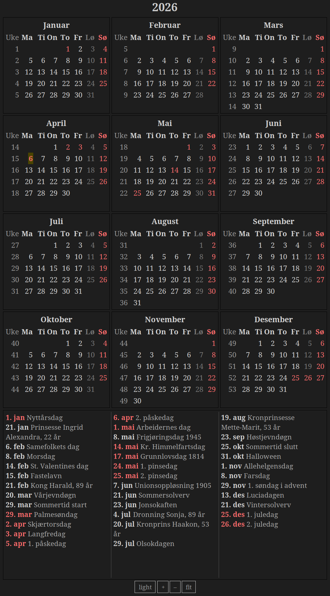

# norcal

A local Norwegian desktop calendar.



## Install

First, install the Tcl/Tk system libraries:

```bash
# Debian/Ubuntu
sudo apt install libtk8.6 tk8.6-dev tcl8.6-dev

# Fedora
sudo dnf install tk-devel tcl-devel

# macOS
brew install tcl-tk
```

### From RubyGems

```
gem install norcal
```

### From source

```bash
git clone https://github.com/baosen/norcal.git
cd norcal
gem build norcal.gemspec
gem install norcal-1.0.0.gem
```

## Usage

```
norcal              # current year, dark mode
norcal 2026         # specific year
norcal --light      # light mode
norcal --light 2026 # light mode, specific year
```

## Features

- 12-month grid (4x3) with Norwegian month and day names
- ISO week numbers, Monday-first weeks
- Sundays and public holidays in red, Saturdays in gray
- Easter-based movable holidays (Computus algorithm)
- Notable dates: royal birthdays, Samefolkets dag, Morsdag, Farsdag, solverv, sommertid, and more
- Today highlighted with yellow background
- Dark mode (default) and light mode, with toggle button

## License

[ISC](LICENSE)
